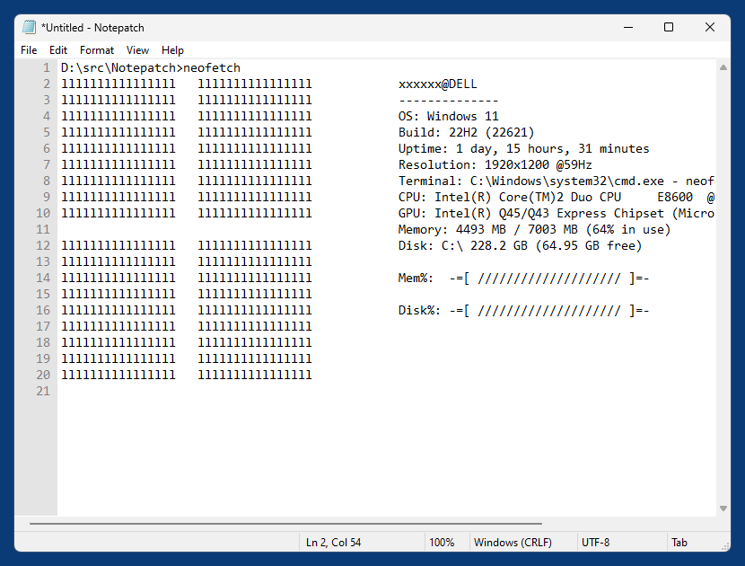
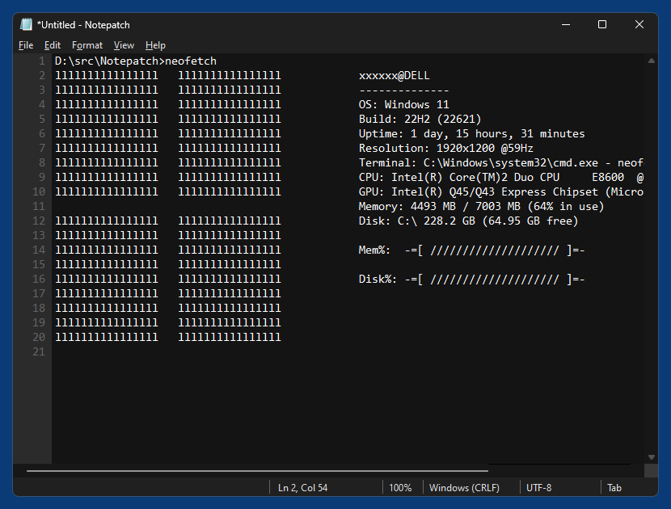
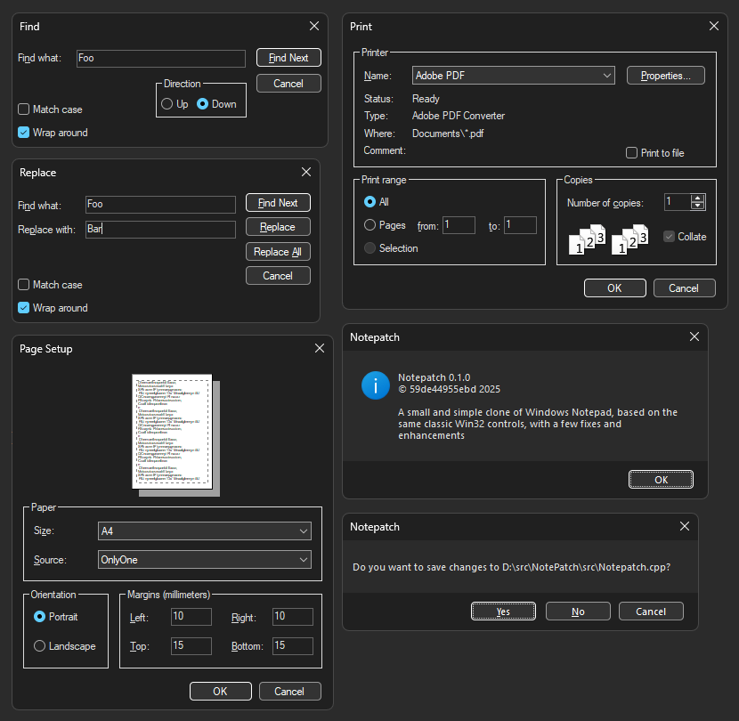

# Notepatch - a small (200 KB) and simple clone of Windows Notepad with a few fixes and enhancements

Notepatch tries to slightly enhance and fix some flaws of classic Notepad, but following the [KISS principle](https://en.wikipedia.org/wiki/KISS_principle). It's neither [Notepad2](https://github.com/ProgerXP/Notepad2e) nor [Notepad++](https://github.com/notepad-plus-plus/notepad-plus-plus), but still just a small and simple single-document (non-tabbed) b/w text/code editor that doesn't know anything about programming languages and syntax highlighting, there is no Scintilla or the like involved.

Since MS Notepad is closed source, Notepatch is not really a "patch" but rather a clone, but it uses exactly the same classic Win32 controls (in particular the [Edit control](https://learn.microsoft.com/en-us/windows/win32/controls/edit-controls) as its core) as well as the same menu, dialog and string resources as original Notepad, only slightly adjusting/extending those resources.

## Features
- Dark mode support (including dialogs) in Windows 10 and 11. The editor's "Theme" can be set to either "Dark", "Light" or "Auto", where the latter means that the editor uses dark mode if and only if the system currently uses a dark theme (for applications).
- View modes (distraction free) "Fullscreen" (F11), "Transparent" (Alt+T) and "Always on Top" (Alt-A) in the "View" menu
- Double-clicking in the text only selects the actual current word (letters, numerals and underscores), like any other editor (except for Notepad) does, but no extra white space or other non-word characters.
- If a multi-line text block is selected, Tab key indents the selected block, Shift+Tab unindents the selected block, accordig to the current indent mode (Tab or Spaces).
- The Enter key preserves the current indentation (leading Tabs or Spaces) in the new line.
- Indent mode can be either Tab or Spaces (so e.g. Python files, which usually use spaces, can also be edited without corrupting them). In Spaces mode the Tab key adds Spaces and the Backspace key removes spaces, both according to the current indent size.
- Indent size can be adjusted - 2, 4 (default), 8 or 16 characters - both in Tab and Spaces mode.
- When multi-line text with Linux (LF) or Mac (CR) line endings is pasted into the editor, the line endings are automatically converted and therefor the text remains in multiple lines
- Current line ending mode (CRLF, LF, CR), text encoding (ANSI, UTF-8, UTF-8 BOM, UTF-16, UTF-16 BE) and indent mode (Tab, Spaces) can be changed, either via extra menus in the File menu or by right or double clicking the corresponding section in the status bar. Saving the document will then apply the new mode to the file saved on disk.
- Supports the same command line arguments as original Notepad:
  - Notepatch /a file.txt -- Deactivates auto encoding detection and loads file as ANSI
  - Notepatch /w file.txt -- Deactivates auto encoding detection and loads file as Unicode (UTF-16 LE)
  - Notepatch /p file.txt -- Prints file with default printer and exits
  - Notepatch /pt "file.txt" "[printername]" -- Prints file with specified printer and exits
- Search/Replace supports "^t" as placeholder for Tab and "^n" as placeholder for line break.
- No "Search with Bing" ;-)
- Single small (about 200 KB) .exe file using little memory.

And that's it.

## Screenshots
*Light mode (Windows 11)*  

*Dark mode (Windows 11)*  

*Dialogs in dark mode (Windows 11)*  

## Optional: Replacing Notepad
If you like, you can replace Notepad with Notepatch by running provided batch script "Notepad-Replace.cmd" as administrator from the same folder as Notepatch.exe. If you move this folder afterwards, you have to run the script again. Running "Notepad-Restore.cmd", again as administrator, will restore original Notepad.

Of course "Notepad-Replace.cmd" doesn't touch the file notepad.exe in the system directory at all, but instead only adds stuff to the system registry (HKLM) that activates "hijacking" (Image File Execution Options) for notepad.exe, so any attempt to execute "notepad.exe" is redirected to "Notepatch.exe". "Notepad-Restore.cmd" will remove this redirection again.

Check the batch script's code and decide yourself if you want to do this.

## Code
To compile the application you need Visual Studio 2017 or later, there are no other dependancies. Since the code was originally written in plain C and only at the end turned into C++, it's still mostly C and e.g. uses malloc/free instead of the C++ equivalents, I guess this should eventually be refactored.
